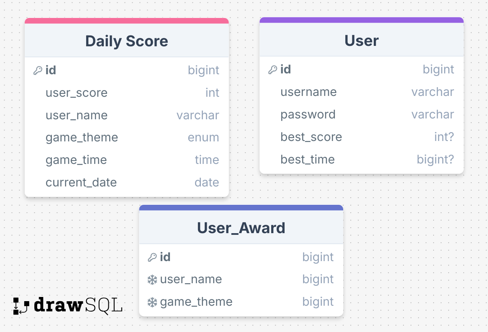

# MathForKids

## The Dream

I grew up playing games like Mavis Beacon and Cluefinders, and I loved every minute. I haven't been able to find similar items, and those games haven't really been re-packaged for newer hardware. I want to make something inspired by those experiences that can be played right on the web.

## Stack

I'm still not fully decided as of now, but planning on Angular as the code base. A good chance of MongoDB as the database, used to store usernames and scores, and possibly even problems. Users won't be required to log in, and I'm thinking that not-logged-in users may have their scores saved for a limited time.

## Timeline

I hope to have a working website and game by the end of this school term (about 3 weeks from now). I don't expect to have anything too fancy by then, but I will continue working until I am satisfied and hopefully until others have a chance to enjoy it, too.

I have until the 16th of June to complete the project. I will be presenting my progress in class on the 9th.

- By the end of next week (the 7th), I hope to have a working website with some CSS specifications.
- By the 13th, I plan to have my database hooked up and functional.
- by the 16th have gameplay functionality for at least one game mode.

## Details and Images

Each user is only able to win an award one time, so a user and award type are together unique in the award table.

## Progress and Time Spent

~5/28 ~30min iterate ideas and prepare project pitch

5/30 1hr design basic project, set up github, deploy vercel

6/2 1.5hr create initial angular components with basic css formatting

6/3 1.2hr create choice buttons for game and other CSS

6/4 1.8hr integrate supabase, set up initial login/signup page

6/5 1hr set up more supabase, arrange page changes based on form submissions

6/6 1.5hr supabase almost working but possibly just ruined

6/7 2hr add leaderboard component, fix game html form

6/8 1.5hr add more game logic and pieces, fix image routing

6/9.1 1.5hr fixing game and forms functionality, mixing up some css

6/9.2 .8hr set up score and reward tables in supabase, begin timer component

6/10 1.4hr struggle with supabase. Thinking it may be better to transition to Mongo instead, though Vercel is half of what makes this battle difficult...
